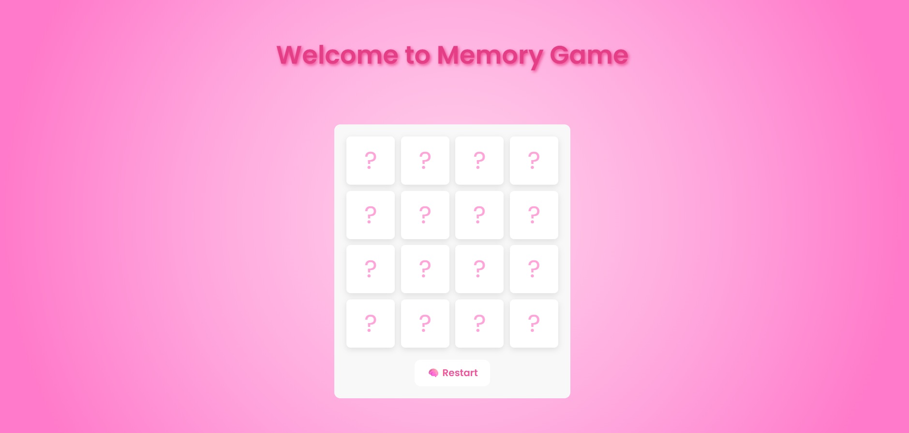

# 🧠 Memory Card Game 🎉

A fun and interactive memory game built using **HTML**, **CSS**, and **JavaScript** — featuring flip animations, sound effects, and confetti on winning!

## 📸 Demo Preview

  

---

## 🚀 Features

- 🎴 Flip-to-match memory cards
- 🔊 Sound effects for flip, match, wrong, and win
- 🎉 Confetti burst on winning
- ✅ Smooth animations and clean UI
- 🔄 Restart button to replay instantly
- 🧠 Win message with auto-hide
- 💻 Fully responsive on desktop and laptop

---

## 🛠️ Tech Stack

- **HTML5** – Structure of the game
- **CSS3** – Styling and layout with flex/grid
- **JavaScript (Vanilla)** – Game logic, flipping, match detection
- **Canvas Confetti** – For win celebrations
- **Google Fonts + Material Icons** – For styling cards and UI

---

## 📂 Folder Structure
```bash
project/
├── index.html
├── style.css
├── script.js
├── README.md
├── Sounds/
│   ├── flip.mp3
│   ├── match.mp3
│   ├── wrong.mp3
│   └── win.mp3
├── Images/
│   ├── apple.png
│   ├── banana.png
│   ├── cherry.png
│   ├── grapes.png
│   ├── kiwi.png
│   ├── raspberry.png
│   ├── strawberry.png
│   └── watermelon.png
└── preview.png


## 💡 Future Ideas
- Timer and move counter
- Scoreboard / leaderboard
- Difficulty levels (e.g., 6x6 grid)
- Dark mode
- Store high scores with localStorage

---

Built with 💖 by Amrita
